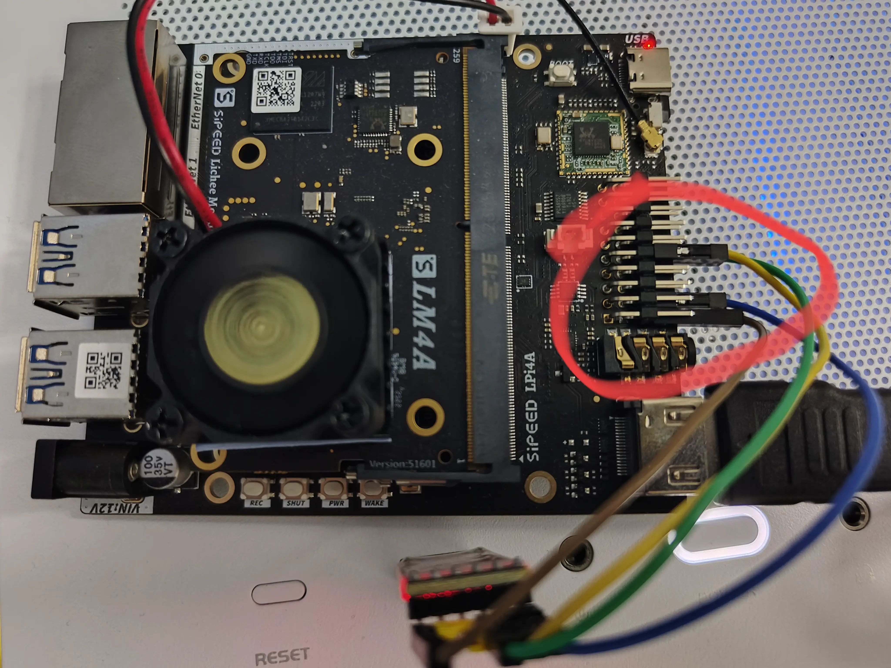

## Debug with UART

When the system fails to boot, you can check the boot logs through pins of UART0.

First, connect the USB to TTL cable to the UART0 interface of the Raspberry Pi 4A. Then, use tools like 'screen' or 'minicom' to read and write to the serial port device.

```shell
› ls /dev/ttyUSB0
╭───┬──────────────┬─────────────┬──────┬───────────────╮
│ # │     name     │    type     │ size │   modified    │
├───┼──────────────┼─────────────┼──────┼───────────────┤
│ 0 │ /dev/ttyUSB0 │ char device │  0 B │ 6 minutes ago │
╰───┴──────────────┴─────────────┴──────┴───────────────╯

› minicom -d /dev/ttyusb0 -b 115200
```




If everything is normal, you should be able to see the startup log at this point. An example is shown below:

```
Welcome to minicom 2.8
brom_ver 8
[APP][E] protocol_connect failed, exit.
OpenSBI v0.9
   ____                    _____ ____ _____
  / __ \                  / ____|  _ \_   _|
 | |  | |_ __   ___ _ __ | (___ | |_) || |
 | |  | | '_ \ / _ \ '_ \ \___ \|  _ < | |
 | |__| | |_) |  __/ | | |____) | |_) || |_
  \____/| .__/ \___|_| |_|_____/|____/_____|
        | |
        |_|

Platform Name             : T-HEAD Light Lichee Pi 4A configuration for 8GB DDR board
Platform Features         : mfdeleg
Platform HART Count       : 4
Platform IPI Device       : clint
Platform Timer Device     : clint
Platform Console Device   : uart8250
Platform HSM Device       : ---
Platform SysReset Device  : thead_reset
Firmware Base             : 0x0
Firmware Size             : 132 KB
Runtime SBI Version       : 0.3

Domain0 Name              : root
Domain0 Boot HART         : 0
Domain0 HARTs             : 0*,1*,2*,3*
Domain0 Region00          : 0x000000ffdc000000-0x000000ffdc00ffff (I)
Domain0 Region01          : 0x0000000000000000-0x000000000003ffff ()
Domain0 Region02          : 0x0000000000000000-0xffffffffffffffff (R,W,X)
Domain0 Next Address      : 0x0000000000200000
Domain0 Next Arg1         : 0x0000000001f00000
Domain0 Next Mode         : S-mode
Domain0 SysReset          : yes

Boot HART ID              : 0
Boot HART Domain          : root
Boot HART ISA             : rv64imafdcvsux
Boot HART Features        : scounteren,mcounteren,time
Boot HART PMP Count       : 0
Boot HART PMP Granularity : 0
Boot HART PMP Address Bits: 0
Boot HART MHPM Count      : 16
Boot HART MHPM Count      : 16
Boot HART MIDELEG         : 0x0000000000000222
Boot HART MEDELEG         : 0x000000000000b109
[    0.000000] Linux version 5.10.113 (nixbld@localhost) (riscv64-unknown-linux-gnu-gcc (GCC) 13.1.0, GN0
[    0.000000] OF: fdt: Ignoring memory range 0x0 - 0x200000
[    0.000000] earlycon: uart0 at MMIO32 0x000000ffe7014000 (options '115200n8')
[    0.000000] printk: bootconsole [uart0] enabled
[    2.292495] (NULL device *): failed to find vdmabuf_reserved_memory node
[    2.453953] spi-nor spi0.0: unrecognized JEDEC id bytes: ff ff ff ff ff ff
[    2.460971] dw_spi_mmio ffe700c000.spi: cs1 >= max 1
[    2.466001] spi_master spi0: spi_device register error /soc/spi@ffe700c000/spidev@1
[    2.497453] sdhci-dwcmshc ffe70a0000.sd: can't request region for resource [mem 0xffef014064-0xffef01]
[    2.509014] misc vhost-vdmabuf: failed to find vdmabuf_reserved_memory node
[    3.386036] debugfs: File 'SDOUT' in directory 'dapm' already present!
[    3.392692] debugfs: File 'Playback' in directory 'dapm' already present!
[    3.399524] debugfs: File 'Capture' in directory 'dapm' already present!
[    3.406262] debugfs: File 'Playback' in directory 'dapm' already present!
[    3.413067] debugfs: File 'Capture' in directory 'dapm' already present!
[    3.425466] aw87519_pa 5-0058: aw87519_parse_dt: no reset gpio provided failed
[    3.432752] aw87519_pa 5-0058: aw87519_i2c_probe: failed to parse device tree node

<<< NixOS Stage 1 >>>

running udev...
Starting systemd-udevd version 253.6
kbd_mode: KDSKBMODE: Inappropriate ioctl for device
Gstarting device mapper and LVM...
checking /dev/disk/by-label/NIXOS_SD...
fsck (busybox 1.36.1)
[fsck.ext4 (1) -- /mnt-root/] fsck.ext4 -a /dev/disk/by-label/NIXOS_SD
NIXOS_SD: recovering journal
NIXOS_SD: clean, 148061/248000 files, 818082/984159 blocks
mounting /dev/disk/by-label/NIXOS_SD on /...

<<< NixOS Stage 2 >>>

running activation script...
setting up /etc...
++ /nix/store/2w8nachmhqvbjswrrsdia5cx1afxxx60-util-linux-riscv64-unknown-linux-gnu-2.38.1-bin/bin/findm/
+ rootPart=/dev/disk/by-label/NIXOS_SD
++ lsblk -npo PKNAME /dev/disk/by-label/NIXOS_SD
+ bootDevice=/dev/mmcblk1
++ lsblk -npo MAJ:MIN /dev/disk/by-label/NIXOS_SD
++ /nix/store/zag1z2yvsh2ccpsbgsda7xhv4sfha7mj-gawk-riscv64-unknown-linux-gnu-5.2.1/bin/awk -F: '{print '
+ partNum='26 '
+ echo ,+,
+ sfdisk -N26 --no-reread /dev/mmcblk1
GPT PMBR size mismatch (8332023 != 122894335) will be corrected by write.
The backup GPT table is not on the end of the device. This problem will be corrected by write.
warning: /dev/mmcblk1: partition 26 is not defined yet
Disk /dev/mmcblk1: 58.6 GiB, 62921900032 bytes, 122894336 sectors
Units: sectors of 1 * 512 = 512 bytes
Sector size (logical/physical): 512 bytes / 512 bytes
I/O size (minimum/optimal): 512 bytes / 512 bytes
Disklabel type: gpt
Disk identifier: 58B10C85-BB4D-F94A-9194-82020FC9DC23

Old situation:

Device          Start     End Sectors  Size Type
/dev/mmcblk1p1  16384  425983  409600  200M Microsoft basic data
/dev/mmcblk1p2 425984 8331990 7906007  3.8G Linux filesystem

/dev/mmcblk1p26: Created a new partition 3 of type 'Linux filesystem' and of size 54.6 GiB.

New situation:
Disklabel type: gpt
Disk identifier: 58B10C85-BB4D-F94A-9194-82020FC9DC23

Device           Start       End   Sectors  Size Type
/dev/mmcblk1p1   16384    425983    409600  200M Microsoft basic data
/dev/mmcblk1p2  425984   8331990   7906007  3.8G Linux filesystem
/dev/mmcblk1p3 8333312 122892287 114558976 54.6G Linux filesystem

The partition table has been altered.
Calling ioctl() to re-read partition table.
Re-reading the partition table failed.: Device or resource busy
The kernel still uses the old table. The new table will be used at the next reboot or after you run part.
Syncing disks.
+ /nix/store/wm9ynqbkqi7gagggb4y6f4l454kkga32-parted-riscv64-unknown-linux-gnu-3.6/bin/partprobe
+ /nix/store/yln7ma9dldr3f2dva4l0iq275s4brxml-e2fsprogs-riscv64-unknown-linux-gnu-1.46.6-bin/bin/resize2D
resize2fs 1.46.6 (1-Feb-2023)
Filesystem at /dev/disk/by-label/NIXOS_SD is mounted on /; on-line resizing required
old_desc_blocks = 1, new_desc_blocks = 1
The filesystem on /dev/disk/by-label/NIXOS_SD is now 988250 (4k) blocks long.

+ /nix/store/f5w7dd1f195bxkashhr5x0a788nxrxvc-nix-riscv64-unknown-linux-gnu-2.13.3/bin/nix-store --load-b
+ touch /etc/NIXOS
+ /nix/store/f5w7dd1f195bxkashhr5x0a788nxrxvc-nix-riscv64-unknown-linux-gnu-2.13.3/bin/nix-env -p /nix/vm
+ rm -f /nix-path-registration
starting systemd...

Welcome to NixOS 23.05 (Stoat)!

[  OK  ] Created slice Slice /system/getty.
[  OK  ] Created slice Slice /system/modprobe.
[  OK  ] Created slice Slice /system/serial-getty.......
......
```

